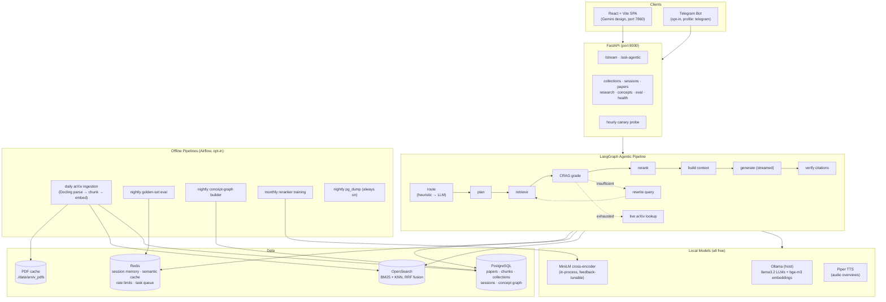
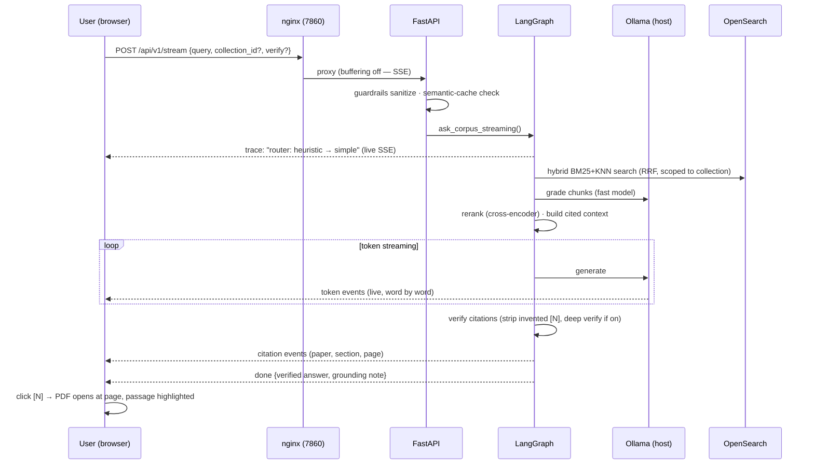

# Corpus — Agentic Research Paper Curator

> *Ask your papers anything — cited to the exact page, every time.*

**Corpus** is a production-grade, fully open-source agentic RAG system for research papers. It ingests papers from arXiv (or your own PDFs and Zotero library), and answers technical questions with **every claim cited to the exact page of the exact source** — viewable in an in-app PDF reader with the cited passage highlighted. It runs **100% locally and free**: no paid APIs, no cloud dependencies.

The UI follows the **Google Gemini design language** — light/dark themes, the signature gradient, pill-shaped surfaces, and functional motion.

---

## Feature Highlights

| Category | Features |
|---|---|
| **Trustworthy answers** | Inline `[N]` citations → exact PDF page with passage highlighting · deterministic + optional LLM claim verification ("deep verify") · honest gap admission · extractive fallback when the LLM is down (retrieval never fails) |
| **Gemini-style chat** | True token streaming (SSE) · live agent-trace timeline · voice input · attach-a-PDF and chat with it · collections (notebook-scoped chat) · semantic answer cache |
| **Research tools** | **Deep Research**: background agent writes a fully-cited literature review · **Research Galaxy**: interactive concept-graph visualization · related-work discovery via Semantic Scholar · audio overviews (local Piper TTS) · figures/tables gallery + visual-only search · reading tracker · Zotero import · export to Markdown + BibTeX |
| **Quality flywheel** | Nightly golden-set evaluation (RAGAS + retrieval hit@k/MRR) with trend charts · thumbs feedback → monthly reranker fine-tuning with an **auto-promotion eval gate** · hourly canary probe |
| **Operations** | Nightly Postgres backups + one-command restore · Prometheus metrics + Grafana dashboard · Langfuse tracing (opt-in) · request correlation IDs · dead-letter view for failed ingestions · lean/full Docker profiles · CI with unit, integration, and browser E2E tests |

---

## System Architecture



## End-to-End: What Happens When You Ask a Question



**The ingestion path** (daily DAG or PDF upload): arXiv fetch / upload → **Docling** layout-aware parse (sections, tables, figures, equations, **page numbers**) → structure-aware chunking (~500 words, atomic visual blocks) → visual-summary LLM pass → **bge-m3** embeddings via Ollama → dual-write to Postgres (source of truth) + OpenSearch (search index).

---

## Quick Start

**Prerequisites:** Docker Desktop, [Ollama](https://ollama.com) installed natively on the host, Node 20+, Python 3.12 + [uv](https://docs.astral.sh/uv/).

```powershell
# 1. Models (one-time, ~3GB total)
ollama pull llama3.2:1b        # LLM (use llama3.2:3b+ with ≥16GB free RAM)
ollama pull bge-m3             # embeddings (1024-dim)

# 2. On low-RAM machines, cap Ollama's context (prevents OOM):
#    set user env vars: OLLAMA_CONTEXT_LENGTH=8192, OLLAMA_KEEP_ALIVE=30m
#    AMD iGPU on Windows: also OLLAMA_VULKAN=0

# 3. Configure
copy .env.example .env         # defaults work out of the box

# 4. Start the lean stack (6 containers)
docker compose up -d

# 5. Ingest some papers
docker exec corpus-api python -m src.run_ingest

# 6. Open the app
#    http://localhost:7860
```

**Optional profiles:**

```powershell
docker compose --profile observability up -d   # Prometheus, Grafana, Langfuse
docker compose --profile airflow up -d          # scheduled DAGs (ingestion, eval, concepts, training)
docker compose --profile telegram up -d         # Telegram bot (needs TELEGRAM__BOT_TOKEN in .env)
```

---

## Key Configuration (.env)

| Variable | Default | Purpose |
|---|---|---|
| `LITELLM__DRAFTING_MODEL` etc. | `ollama/llama3.2:1b` | LLM per role (reasoning/drafting/fast) — one line to upgrade |
| `MODEL_AUTOSELECT` | `true` | Probe-and-pick the best loadable model at startup |
| `EMBEDDING__BACKEND` | `ollama` | `ollama` (bge-m3, fast) or `local` (sentence-transformers) — **changing requires `uv run python -m src.run_reindex`** |
| `RERANKER__MODEL` | `cross-encoder/ms-marco-MiniLM-L-6-v2` | Point at `models/reranker-tuned` after feedback training |
| `ENABLE_LLM_VERIFICATION` | `false` | Always-on LLM claim checking (the UI shield toggles it per-question) |
| `SEMANTIC_CACHE_ENABLED` | `true` | Serve near-duplicate questions instantly |
| `GRADING_MAX_CHUNKS` / `GENERATION_MAX_TOKENS` | `8` / `1024` | CPU latency budget knobs |
| `API_KEY` + `ENVIRONMENT` | — | Auth is enforced outside `development`. nginx injects the key for the SPA, so the UI keeps working and the key never reaches the browser |
| `CORS_ALLOW_ORIGINS` | `localhost:7860,5173,5174` | Only needed for browser clients on a *different* origin than the API |
| `RERANKER__AUTO_PROMOTE` | `true` | Load a feedback-tuned reranker that passed its eval gate, without an `.env` edit |

## Operations

| Task | Command |
|---|---|
| Backup now (nightly is automatic) | `docker exec corpus-backup sh -c 'pg_dump -h postgres -U rag_user -Fc corpus_db > /backups/manual.dump'` |
| **Restore from disaster** | `.\scripts\restore.ps1` (latest dump; rebuilds the index) |
| Re-embed everything | `uv run python -m src.run_reindex` |
| Run the golden evaluation | System page → *Run evaluation*, or `POST /api/v1/eval/run?mode=golden` |
| Train the reranker on feedback | `uv run python scripts/train_reranker.py` |
| Health / canary | `GET /api/v1/health` · `GET /api/v1/health/canary` |
| Metrics | `GET :8000/metrics` (Prometheus) · Grafana at `:3002` |

## Testing

```powershell
uv run pytest tests/unit tests/integration tests/eval    # backend (19 tests)
cd frontend; npx playwright test                          # browser E2E vs mock API
```

CI runs lint (ruff), types (mypy), unit + golden eval, integration (service containers), and the Playwright browser suite on every push.

## Project Structure

```
src/
  agents/        LangGraph pipeline, heuristic router, prompts, tools
  ingestion/     arXiv fetch · Docling parsing · chunking · orchestrator
  retrieval/     hybrid search (BM25+KNN+RRF) · reranker · context builder
  services/      embeddings · LLM adapter · deep research · audio overviews ·
                 canary · guardrails · Zotero · concept extractor · resilience
  routers/       ask/stream · collections · sessions · research · concepts ·
                 integrations · eval · health
  db/ models/    Postgres models + idempotent startup migrations
frontend/        React + Vite + TS (Gemini design system, see DESIGN.md)
airflow/dags/    daily ingestion · nightly eval · concept graph · reranker training
scripts/         restore.ps1 · train_reranker.py
```

## License

MIT — every component in the stack (models, databases, frameworks) is free and open source.
